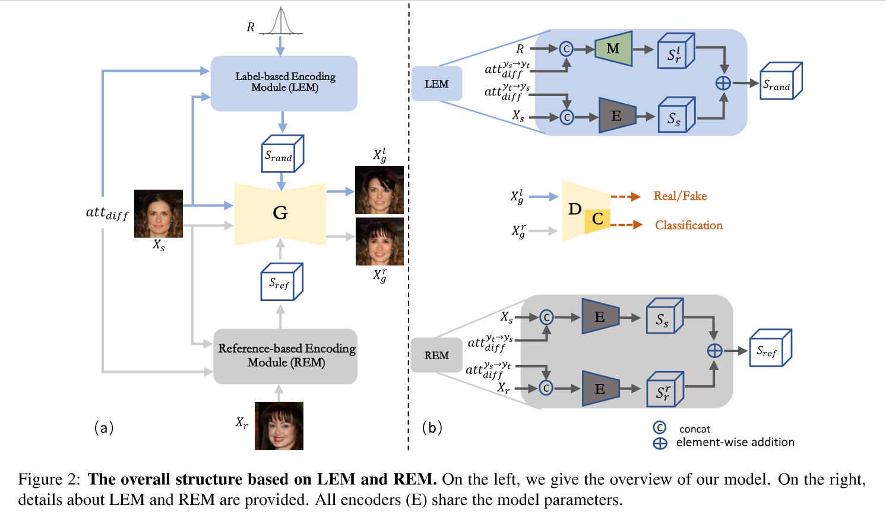
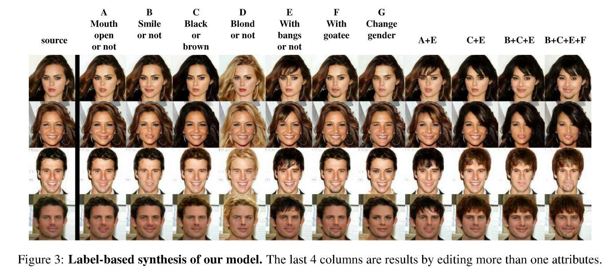
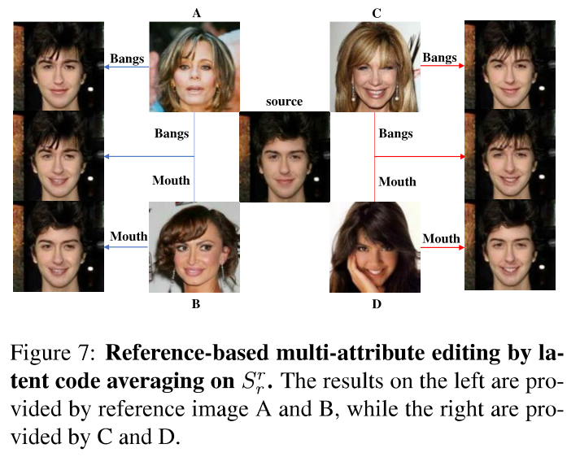
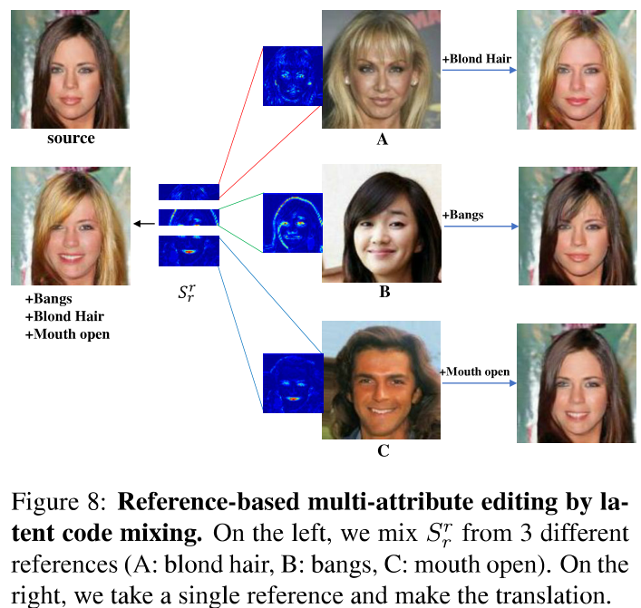

# Bridging-the-Gap-between-Label--and-Reference-based-Synthesis(ICCV 2021)
Tensorflow implementation of [**Bridging the Gap between Label- and Reference-based Synthesis in Multi-attribute Image-to-Image Translation**](https://arxiv.org/pdf/2103.02264).

**Overview architecture**
<p align="center"> <br><center></center></p>

## Experiment Results

- CelebA
<p align="center"> <br><center></center></p>
<p align="center"> <br><center></center></p>
<p align="center"> <br><center></center></p>


## Preparation

- **Prerequisites**
    - Tensorflow 1.15
    - Python 2.x with matplotlib, numpy and scipy
- **Dataset**
    - [CelebA](http://mmlab.ie.cuhk.edu.hk/projects/CelebA.html) 
	- Images should be placed in ./data/CelebA/img_align_celeba
	- tfrecords file should be placed in ./data/CelebA/celeba_tfrecords
## Quick Start

Exemplar commands are listed here for a quick start.
### dataset
- prepare dataset to product tfrecords file

    ```console
    python data_noise_in.py 

### Training
- To train with size of 128 X 128

    ```console
    python train_arch9.py --experiment_name "file_name" --gpu "gpu_num"

    ```

### Testing
- Example of test

    ```console
    python  test_arch9.py --experiment_name "file_name" --gpu "gpu_num"
    ```

## Citation
If this work is useful for your research, please consider citing:
